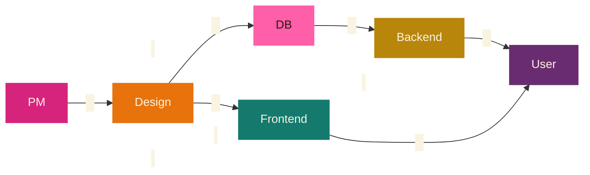
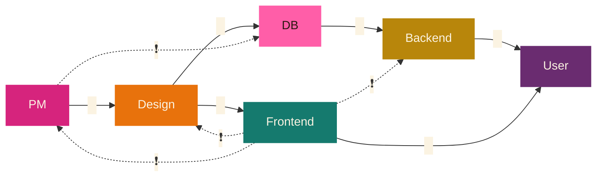
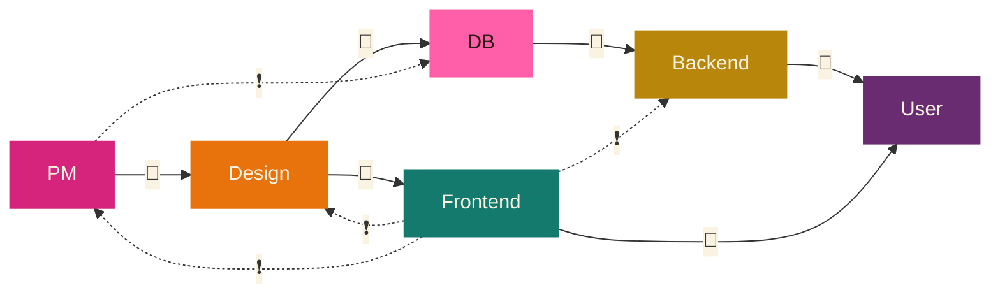

# 4,207 Days of Uptime

### Evolving an Ember App Without a Rewrite

Michal Bryxí

<a class="slidev-contact mt-6" href="https://mastodon.world/@MichalBryxi" target="_blank" rel="noopener">
  
  @MichalBryxi@mastodon.world
</a>

<!--
- Hello EmberFest of 2026.
- I'm Míša. Welcome to my country of origin.
- I came came here to give a talk about how we evolved our codebase for over a decade without a single full rewrite.
-->

---
layout: image-right
image: /photos/moved-to-switzerland.jpg
---

# About Me

<v-click>

### Countries

- 29y 08m - 🇨🇿 Czechia
- 02y 07m - <svg width="1.3em" height="0.87em" viewBox="0 0 60 40" style="display: inline-block; vertical-align: -0.15em; border: 1px solid rgba(0,0,0,0.15); border-radius: 2px;"><rect width="60" height="40" fill="#fff"/><line x1="0" y1="0" x2="60" y2="40" stroke="#c8102e" stroke-width="10"/><line x1="60" y1="0" x2="0" y2="40" stroke="#c8102e" stroke-width="10"/></svg> Northern Ireland
- 02y 10m - 🏴󠁧󠁢󠁳󠁣󠁴󠁿 Scotland
- 05y 00m - 🇨🇭 Switzerland

</v-click>

<v-click>

### Career

- 4y - 🖥️ Sysadmin
- 8y - 🎨 Frontend developer
- 1y - 🌿 Gap year
- 1y - 🎨 Frontend developer
- 1y - 🚲 Bike shop: rental & sale
- ?y - 🪂 TBD

</v-click>

<!--
- A little bit about me. 🔴
- As I hinted, I'm originally from Czechia.
- And nearly a decade ago I moved to Belfast, Northern Ireland.
- Then I lived in few places around Scotland. 
- And finally I ended up in Switzerland. As you can see from this photo of Swiss flags cosplaying as a flag of Amsterdam.
- No laugh? Hmmm I would expect more flag nerds in this audience. 🔴
- Anyway. At the start of my career I worked as a sysadmin.
- But I always liked to work really close to where I can see the value provided to the ordinary people, so I transitioned to work as a front-end developer.
- And lately I've been trying to transition **again**, this time into an outdoor industry.
-->

---

  <figure style="width: 235px; left: -20px; top: -10px; --rot: -5deg; z-index: 5;"><figcaption>Paragliding</figcaption></figure>
  <figure style="width: 235px; left: 140px; top: 200px; --rot: -3deg; z-index: 1;"><figcaption>Climbing</figcaption></figure>
  <figure style="width: 235px; left: 300px; top: -15px; --rot: 6deg; z-index: 6;"><figcaption>Ski touring</figcaption></figure>
  <figure style="width: 255px; left: 460px; top: 175px; --rot: -7deg; z-index: 2;"><figcaption>Trail running</figcaption></figure>
  <figure style="width: 235px; left: 620px; top: -5px; --rot: 4deg; z-index: 4;"><figcaption>T6 scrambling</figcaption></figure>
  <figure style="width: 235px; left: 780px; top: 205px; --rot: 2deg; z-index: 3;"><figcaption>Cold dips</figcaption></figure>

<!--
These are some of my hobbies, so if you want to talk afterwards and need an ice-breaker, I'm more than happy to talk about any and all of those topics. Most of them are connected to the mountains or sports.
-->

---
layout: center
---

## Game

🦄

<!--
- I'm a person that likes games. So naturally this presenation has a mini-game. Every time you will see this unicorn emoji, and you will agree with given statement. Then count one point.
- And at the end of the presentation, whoever collected the most points will win a prize.
-->

---

## How it started

  
Honza
Hey I need a <strong>super simple</strong> app to store information about clients for my hairdresser salon.

  
Me
Why don't you use Excel?

  
Honza
Yeaaaaah, nooo. I have some specific needs, but don't worry, it should not take more than <strong>one weekend</strong> to have it done...

  
Me
OK, sounds good. 🦄

<!--
- I need to start with a little bit of history.
- One day I got a text message from my friend Honza.
- 🔴🔴🔴🔴
- My 11 years younger me was sooo naiive!
- Ha! Unicorn Emoji! Count one unicorn if you ever voluntarily fell into the tar pit of "quick, weekend project".
-->

---
layout: center
---

## Stats

- 1
- 2
- 33
- 33
- 189
- 1,278
- 15,263
- 1,602,376
- 9,250,391

<!--
- Now PSA. This talk is my experience - my learnings, at my size, doing technology and business my way.
- It will likely face 'heh, that wouldn't work here' criticism and that's ok.
- So talking about size, some stats
- 1 main developer
- 2 co-founders
- 33 companies that pay for the product
- 33 db tables - yes, same number, but it's not a typo
- 189 Ember components
- 1,278 merges - representing features or bugfixes
- 15,263 lines of component code
- 1,602,376 primary database rows
- 9,250,391 Euro in recorded sales across every customer
-->

---
layout: image-right
image: /screenshots/kasa-reservations-calendar.webp
backgroundSize: contain
---

## kasa

Sells
Revenues
Visits
Cashbook entries
Taxes
Reservations
Item dispenses
Supplies
Notifications
Settlement items
Customers
Items
Schedules
Wages
Items reservations
Settlements
Vouchers
Voucher claims
Employees
Invoices
Payments
Users
Entities
Signups
Roles
Locales
Languages
Registrations

<!--
- Now what is **it** that we built? In Czech the project is called "kasa", which translates as "cashier register". And it is an end-to-end IT solution for Health&Beauty Salons.
- Wink wink to one of the sponsors of this conference because they are quite likely our direct competitor.
- Just for an idea. On the left you can see the word cloud of all the domains we solve for the customers. And on the right there is a screenshot. For the purpose of this talk the UI is not important.

-->

---
layout: center
---

## The stack

## 2015

- ember-cli 0.2.0-beta.1
- Ember 1.11.0-beta.2
- Ember Data 1.0.0-beta.15
- Rails 4.2.0
- PostgreSQL 9.4 (est.)

## 2026

- ember-cli 7.1.0
- Ember 7.1.0
- WarpDrive 5.8.2
- Rails 7.2.3.1
- PostgreSQL 17.9

<!--
- Now is it a big deal? Or even a good thing? That we never rewrote the app?
- I do think so, if done right.
- I've been in a project where my next-gen in-progress rewrite of an app has been actively deprecated by an app from other team.
- And on the other hand I've seen 5000+ lines of core spaghetti source code file (singular) never being touched by anyone out of pure horror of what might break.
- Whenever we started this project in 2015, Ember was still quite young.
- Fun fact is that we used version of Ember Data that was not officially released out of Beta.
- Nowadays, we are pretty close to the latest & greatest.
- And it is quite a pride of mine that the foundational building blocks did not have to be swapped over the years.
-->

---
layout: center
---

# How

<!--
- Now, how did it happen that we needed zero rewrites over the years?
-->

---
layout: image-right-narrow
image: /memes/data-is-king.jpg
---

## Data is king

<v-click>

> 🦄 Everything starts from the data

</v-click>

<!--
- 1st Reason: For us the data is king. 🔴 
- Everything starts from the data. New feature request. New design. UX improvement. Workflow. **Everything** starts from the data.
- This might be a surprise to the audience here. Because ... checks notes. Wasn't this ... like ... UI framework conference? What is this backend stuff doing here?
- We as frontend developers care about beautiful UIs, clear UX, the presentation of things.
- We use Canva, Figma, Storybook to start our work. Not data.
- At most we care about APIs, that's it.
-->

---

## Breaking the kingdom

<v-switch>

<template #0>

</template>

<template #1>

</template>

<template #2-3>

</template>

</v-switch>

<!--
- Well ... no. I don't see it like that. 🔴
- In my other lives I've seen PM fixing assumptions about database schemas. I've seen frontend franatically running between design and backend to understand if the figma document is doable at all. I've seen UI-s, API-s, backend-s (all plural) all baked into one app trying to pretend that this Frankenstein's monster somehow can learn to walk. I've experienced team of 6 to go through the pain of agile traffic snake to deliver a single button doing single XHR call in three weeks! I have been the UI engineer desperately waving hands because left side of the stack did not have the data I wanted. And right side requested data I could not provide.
- I've been there. It's not pretty. 🔴 A lot of walls.
- Many of those because of misunderstanding of of the data. Their shape.
-->

---

> 🦄 Fullstack FTW*

*) For The Win

<!--
- What historically worked for us is a cooperation of fullstack engineers, supported by specialist consultants where appropriate.
- So my next claim is that the standard separation of roles on frontend/backend/etc. is often times not a good choice and we just do it, because we were told to. And in many cases FullStack role is better.
- So. Once we broke the old kingdom and established the data as a new king. We need to...
-->

---
layout: image-right-narrow
image: /memes/data-kiss.png
---

## KISS data

<v-click>

- 1971 - Edgar F. Codd
- Further Normalization of the Data Base Relational Model

</v-click>

<v-click>

> 🦄 Doesn't elegantly fit relational modeling == We don't understand our data well enough.

</v-click>

<!--
- KISS the data!
- Not the way I meant it.
- What I **obviously** meant is the "Keep It Super Simple" principle.
- To make our data and subsequently our work with them simple. 🔴
- Luckily already in 1971 one super smart person called Edgar Codd wrote a paper on this topic. And we can just follow his thoughts around 2nd normal form.
- For us UI is just a thin wrapper over API. Plus some animations and stuff. And subsequently API is just a thin wrapper over database. Plus minus. 🔴
- And this sisutation can only happen if a database schema is well designed.
- For us, every signle time the DB schema felt off, it produced weirdnesses in the API, which created cumbersome UX, which was then reported by the users and came back like a boomerang.
- And to my previous point: If I would be specialising only on frontend, this would be discovered quite late. 
-->

---

> 🦄 Everyone on the team should fluently speak [2nd normal form](https://en.wikipedia.org/wiki/Second_normal_form).

<!--
- And therefore.
- Everyone on the team should fluently speak 2nd normal form.
- And by everyone I mean everyone: DB folks, backend folks, frontend folks, designers, PMs, ...
- Talking about features in abstracted layers like APIs or UI mockups is beneficial for the simplicity, but hides the details, weirdnesses, challenges that add friction and create misunderstandings.
- Although Honza is not from IT we've had the most constructive discussions about new features, bugfixes, strategic changes, I've ever exerienced in any of my IT jobs. And in my opinion that is because he understands 2nd normal form.
-->

---

## Pattern (singular)

<v-clicks>

- JSON:API
- EmberJS
- WarpDrive
- Tailwind
- Component patterns (plural)

</v-clicks>

<v-clicks>

> 🦄 New pattern is only allowed when it completely replaces old pattern. In one PR.

</v-clicks>

<!--
- Once we got the right data and get them the right shape, it's time to start thinking about pattern. Singular.
- We picked one for each: 🔴 API, 🔴 JS framework, 🔴 Data layer, 🔴 CSS framework, Userspace Component Patterns, etc and stuck with it. No new shiny. No mix & match. No compromises. Everything has to fit into the line.
- Keep things: Boring, simple, predictable. 🔴 
- I've seen so many corporate code zombies living years and years past their expiry time. So we, in our project, have a rule: No new pattern unless old one is double-tapped. (Zombieland reference)
-->

---

### Example

Your story will be different.

> 🦄 Every entity will eventually need: sort, paginate, filter, aggregate, bulk operations, export.

<!--
- Over time new userspace component patterns start emerging. And we see that we can simplify further. That previously distinct, bespoke use-cases or components have actually in common more than what we thought. Nothing new. We can just merge them and use one component instead.
- For us, every entity eventually needed: sort, paginate, filter, aggregate, bulk operations, export.
- If you look at my socials, you will see me constantly whining about apps that don't have one of those for some entities.
- Having this assumption in mind, we design every use-case with those as a bare minimum.
- And we always build those use-cases from the same UI blocks. D'uh.
-->

---

### therefore:

> 🦄 This app could've been an excel spreadsheet.

<!--
- This has the added benefit for the user. As unified UX is easier to navigate.
- Remember my initial conversation with Honza?
- Yes, we're basically building an excel spreadsheet with better UX.
- And I think many apps would benefit from admitting that they are doing anything but that and just stop inventing new ways to annoy the users with nonsensical patterns.
- Many users migrated to us from an excel spreadsheet.
- And many users do use excel to achieve features we don't have. Yet.
- Because we offer excel friendly export for pretty much every entity.
- We don't fight Excel, we embrace it.
- There is this simple lakmus test: If your app could be replaced by Excel and the UX would improve...
-->

---

### and therefore:

> 🦄 `<DataGrid>` like pattern is good.

<v-clicks>

- 30
- 60
- 245

</v-clicks>

<v-click>

> 🦄 The best code is the one that was not written.

</v-click>

<!--
- `<DataGrid>`, as we call it, is our most complex component to date. 
- It saved incredible amount of lines of code. Mass fixed tons of bugs. And is just great for long term maintenance.
- Take this new entity. Here's some optional configuration. Bam, new use-case done. The user has excel-like capabilities for that entity.
- Literally in 5 minutes.
- Obviously in reality it's more complicated than that, but it is not far off.
- Virtually every entity in our app eventually evolved a `<DataGrid>` view. 🔴 
- We have `30` entities. So direct saving is 30 use-cases. 🔴
- 1st level hop in our relationship graph creates another `60` saved use-cases. 🔴
- 2nd level hop saves us `245` saved use-cases.
- And so on. It adds up really quickly. 🔴
- And the best code is obviously the one that was not written at all. No code, no bugs, no maintenance cost.
-->

---
layout: center
class: text-center
---

# 4,207 days later

## Still the same ship of Theseus

### Still shipping

<v-click>
Thank you
</v-click>

<!--
- Obviously `<DataGrid>` is not the only big pattern in our app.
- But we would have a really hard time finding any of the patterns if we would not intimately understand the data we have.
- And we would have heaps more work to keep the code tidy&up to date if we would not have those patterns.
- If your app right now feels like Frankenstein's monster, let me tell you:
- **Your** team will find **your** own pattern, based on the shape of **your** data and the needs of **your** users.
- There will be one.
- And you will find it.
- And simplify your code.
- And live happily ever after.
- Once you understand your data well enough. 🔴
- Thank you.
-->

---

> 🦄 Automation, cleanup and refactoring tasks are always the highest priority tasks.

> 🦄 Design systems exist to describe the behavior & interactions of components. Describing how component look is optional.

> 🦄 Mono(repo|lith) > Many(repo|services).

> 🦄 UX is the first step of security.

<!-- 
- For the sake of giving you a chance for more unicorn points, here is the final slide.
- Those are topics I feel also quite passionate about.
- But they felt a bit off topic for the scope of this talk.
- Happy to talk about any of those points later.
- Thank you again.
-->

